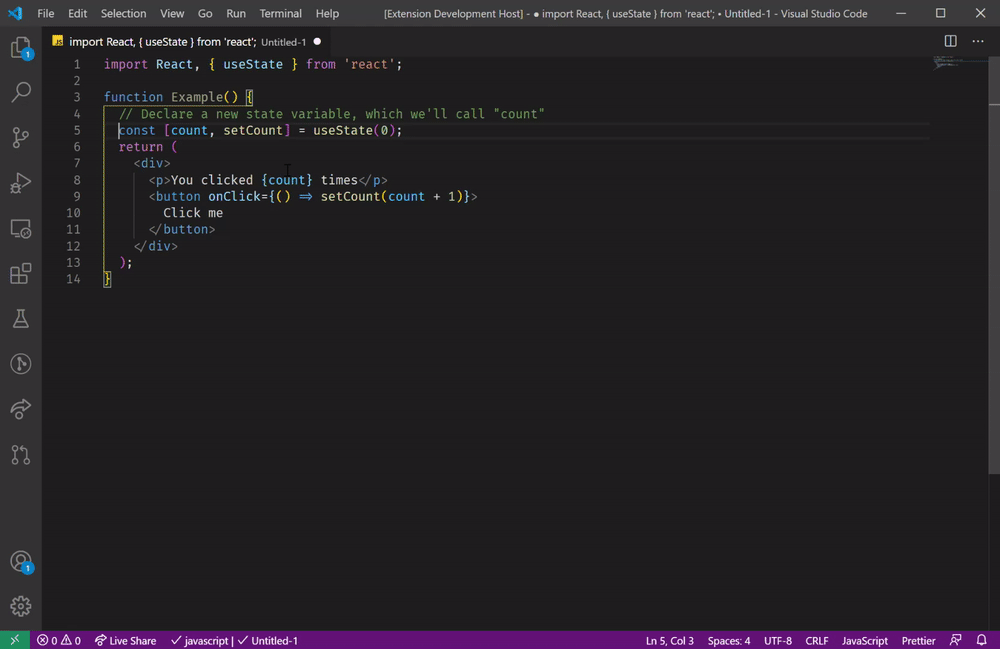

## Features

Typing with a selection active overtypes rather than deleting the selection. The case is matched - lowercase letters match the case being overtyped whereas uppercase letters invert case. This is useful for replacing text with different cases.

e.g. `count` and `setCount`

If you don't want this behaviour you can just delete the selection first. Symbols are ignored to support surrounding with brackets.

## Requirements

None

## Extension Settings

None

## Pull requests

Accepting pull requests
